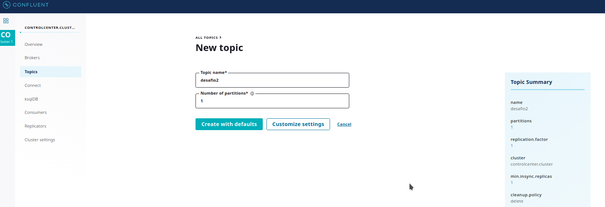

# Imersão Fullstack Fullcycle CodeEdu

Códigos utilizados e desenvolvidos na imersão fullstack fullcycle da CodeEdu, assuntos abordados:
    - gRPC
    - Apache Kafka
    - Nest.js
    - Next.js
    - DevOps e Kubernetes

## Uso do Apache Kafka

  
  
  
 
  

  

